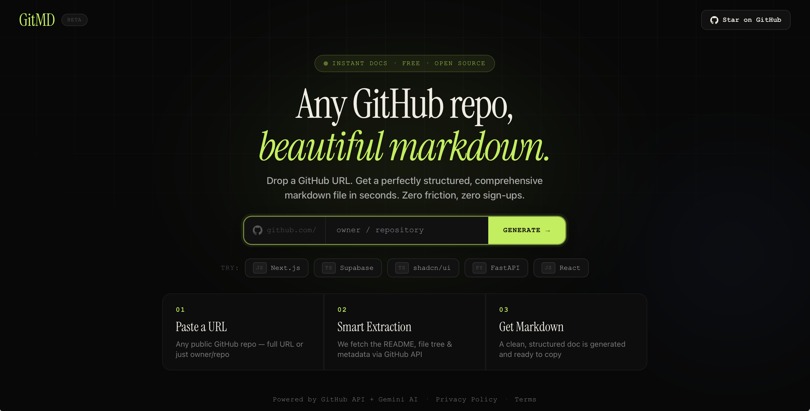

<div align="center">

# $${\huge \color{#b8f040} 🪄GitMD✨}$$

**Any GitHub repo, beautiful markdown. Zero friction.**

A modern, serverless web application that instantly transforms any public GitHub repository into a clean, comprehensive markdown document using the GitHub API and advanced LLM processing.

<a href="https://git-md.vercel.app" target="_blank" rel="noopener noreferrer">
  
</a>

<br />

[](https://nextjs.org/)
[](https://vercel.com/)
[](https://upstash.com/)
[](https://deepmind.google/technologies/gemini/)
[](https://docs.github.com/en/rest)

[](https://git-md.vercel.app)

</div>


## 🚀 Key Features

* **Smart Extraction:** Programmatically fetches repository metadata, READMEs, and file structures directly via the GitHub API.
* **AI-Powered Generation:** Utilizes Gemini AI to synthesize raw repository data into well-structured, easy-to-read markdown.
* **High-Performance Caching:** Implements a robust Cache-Aside architecture using Vercel KV (Upstash Redis) to deliver single-digit millisecond response times for previously generated repositories.
* **Rate-Limit Protection:** Safely manages GitHub API constraints by persisting data across serverless cold starts with a strict 6-hour Time-To-Live (TTL) eviction policy.
* **Premium UI/UX:** Built with Next.js, featuring a dark-mode optimized, responsive interface with typography-driven design and tactile micro-interactions.

## 🏗 System Architecture

GitMD is built on a serverless, edge-ready architecture designed for speed and reliability. Below is the high-level data flow illustrating the Cache-Aside pattern:

```text
User Request
 └──> [ Next.js Frontend ] 
       └──> POST /api/generate 
             └──> [ Vercel KV (Redis) Cache Check ]
                         │
                   Hit?  │  Miss? (or 'Force Refresh')
            ┌────────────┴────────────┐
            ▼                         ▼
    [ Return Cached ]         [ Fetch GitHub API ]
    [   Markdown    ]         [  (repo details)  ]
                                      │
                                      ▼
                              [  LLM Processing  ]
                              [ (Generate Docs)  ]
                                      │
                                      ▼
                              [ Save to Vercel KV ]
                              [   (6-hour TTL)    ]
                                      │
                                      ▼
                              [ Return Fresh Data ]
```

## 🔄 Data Flow Breakdown
* **Client Request:** The user submits a target repository (owner/repo).

* **Cache Interception:** The API queries the Redis database using a unique repository key. If a valid cache exists, it is instantly returned.

* **Data Extraction:** On a cache miss, the backend securely communicates with the GitHub API to pull the repository context.

* **AI Processing:** The raw data payload is handed off to Gemini AI for contextual markdown generation.

* **Persistence:** The newly generated markdown is saved to Redis with a 21600s (6-hour) TTL before being returned to the user. Users can explicitly bypass the cache using the "Refresh" parameter to force a new generation.

## 🔒 Security & Environment
This repository is private. The application relies on securely stored environment variables injected at build time:

* **GITHUB_TOKEN:** Manages elevated rate limits for repository extraction.

* **GEMINI_API_KEY:** Authenticates with the AI provider.

* **KV_REST_API_URL & KV_REST_API_TOKEN:** Secures the Redis connection for caching.

<div align="center">
Built with ❤️ by Yashraj to make repository documentation feel effortless.
</div>
